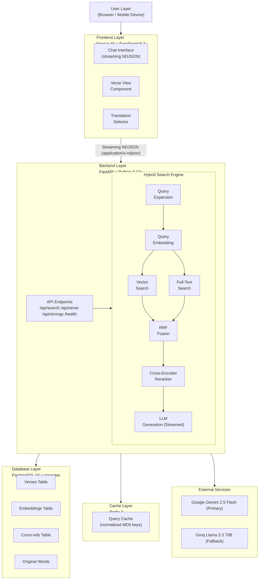

# Bible RAG - System Architecture

Comprehensive technical architecture documentation for the Bible RAG system.

## Table of Contents

- [System Overview](#system-overview)
- [RAG Workflow](#rag-workflow)
- [Search Pipeline](#search-pipeline)
- [Component Architecture](#component-architecture)
- [Data Flow](#data-flow)
- [Embedding Strategy](#embedding-strategy)
- [Vector Search Implementation](#vector-search-implementation)
- [Caching Architecture](#caching-architecture)
- [Rate Limiting & Fallbacks](#rate-limiting--fallbacks)
- [Scalability Considerations](#scalability-considerations)
- [Performance Optimization](#performance-optimization)

---

## System Overview

### High-Level Architecture



### Design Principles

1. **Separation of Concerns**: Clear boundaries between presentation, business logic, and data layers
2. **Stateless Backend**: All requests are independent, enabling horizontal scaling
3. **Caching-First**: Fully normalized Redis cache keys to maximize hit rate across equivalent queries
4. **Graceful Degradation**: Gemini → Groq LLM fallback; search results always returned even if both LLMs fail
5. **Korean-First UX**: Typography, fonts, and text handling optimized for Korean users
6. **Self-Hosted ML**: Embedding and reranking models run locally — no external API rate limits
7. **Streaming Responses**: NDJSON streaming separates search results from AI token generation so the UI is responsive

---

## RAG Workflow

### Complete Search Flow

```mermaid
flowchart TD
    A["1. User Query (chat)\n사랑에 대한 예수님의 말씀"]

    B["2. Language Detection & Preprocessing\n- Detect: Korean (ko)\n- Normalize: Unicode NFC"]

    C["3. Cache Check (Redis)\nKey: MD5(normalized query + sorted translations)\nHit? → Return cached results < 50ms\nMiss? → Continue to step 4"]

    D["4. Query Expansion (LLM)\nGenerate 3 alternative phrasings\ne.g. '예수님의 사랑 가르침', '신약성경 사랑 말씀'\nTime: ~200-500ms"]

    E["5. Query Embedding\nModel: multilingual-e5-large (self-hosted)\nPrefix: 'query: ' + text\nOutput: 1024-dim normalized vector\nTime: ~50-100ms (CPU)"]

    F["6. Hybrid Retrieval (parallel)\na) Vector similarity (pgvector cosine)\nb) Full-text search (PostgreSQL tsvector)\nRun for original + all expanded queries\nTime: ~200-500ms"]

    G["7. Reciprocal Rank Fusion (RRF)\nMerge vector + FTS rankings\nRRF(d) = Σ 1/(k + rank), k=60\nSelects top-30 candidates\nTime: < 10ms"]

    H["8. Cross-Encoder Reranking\nModel: BAAI/bge-reranker-v2-m3\nScore each top-30 candidate vs original query\nTime: ~50-200ms"]

    I["9. Context Retrieval\nFor each final verse:\n- Fetch translations\n- Fetch cross-references\n- Fetch original language words"]

    J["10. Stream: type=results\nYield search results immediately\nFrontend renders verse cards"]

    K["11. Stream: type=token\nGemini Flash (primary) or Groq (fallback)\nIncludes conversation_history context\nFrontend appends tokens to message"]

    L["12. Cache Full Result (Redis, 24h TTL)"]

    A --> B
    B --> C
    C -->|Cache miss| D
    D --> E
    E --> F
    F --> G
    G --> H
    H --> I
    I --> J
    J --> K
    K --> L
```



**Total Time Breakdown:**
- **Cached query**: 50-100ms
- **Cold query (no cache)**: 1.5-3 seconds
  - Query expansion: 200-500ms
  - Embedding: 50-100ms
  - Hybrid retrieval: 200-500ms
  - RRF + reranking: 50-200ms
  - Context retrieval: 100-200ms
  - LLM first token: 500-1500ms

---

## Search Pipeline

The search pipeline is the core of Bible RAG. It chains multiple retrieval and ranking stages for high-quality results.

### Stage 1: Query Expansion

Before embedding, the LLM generates 3 alternative phrasings of the user query in the same language. Each phrasing captures a different semantic aspect. All phrasings plus the original are embedded and searched in parallel.

**Config**: `enable_query_expansion = True` (default)

### Stage 2: Hybrid Retrieval

Two retrieval signals run concurrently for each query variant:

**Vector search** (pgvector, `embeddings` table):
```sql
SELECT verse_id, 1 - (vector <=> $query_vector::vector) AS score
FROM embeddings
WHERE 1 - (vector <=> $query_vector::vector) > 0.55
ORDER BY vector <=> $query_vector::vector
LIMIT $n
```
- Similarity threshold: 0.55 (tuned for recall)
- Prefix: `"query: "` for queries, `"passage: "` for stored verses

**Full-text search** (GIN index, `verses` table):
```sql
SELECT v.id, ts_rank(to_tsvector('english', v.text), query) AS score
FROM verses v, plainto_tsquery('english', $query) AS query
WHERE to_tsvector('english', v.text) @@ query
LIMIT $n
```
- Complementary signal, especially for exact phrase and keyword matches

### Stage 3: Reciprocal Rank Fusion (RRF)

Merges all vector and FTS result lists from all query variants:

```
RRF_score(d) = Σ_lists  1 / (k + rank(d))
```

- `k = 60` (smoothing constant, from config `rrf_k`)
- `overretrieve_factor = 3`: fetches 3× max_results from each signal before fusion
- Top 30 candidates forwarded to reranker

### Stage 4: Cross-Encoder Reranking

BAAI/bge-reranker-v2-m3 rescores each of the top-30 candidates against the **original** user query:

- Multilingual cross-encoder trained for passage relevance scoring
- Significantly more accurate than embedding cosine similarity alone
- Final top-K returned based on reranker scores
- Reported in response `search_metadata.search_method` as `"hybrid-rrf+rerank"`

**Config**: `enable_reranking = True`, `reranker_model = "BAAI/bge-reranker-v2-m3"`, `rerank_top_n = 30`

---

## Component Architecture

### Backend Components

#### 1. FastAPI Application (`backend/main.py`)

- Router registration: search, verses, themes, metadata, health
- CORS: `localhost:3000` + production origins from `ALLOWED_ORIGINS` env var
- Allowed headers: `X-Gemini-API-Key`, `X-Groq-API-Key` (user-supplied keys)
- Lifespan context manager (startup/shutdown hooks)

#### 2. Search Router (`backend/routers/search.py`)

Returns `StreamingResponse` with `application/x-ndjson` content type.

NDJSON event schema:
```json
{"type": "results", "data": {"query_time_ms": 1245, "results": [...], "search_metadata": {...}}}
{"type": "token",   "content": "Based on these passages..."}
{"type": "error",   "message": "..."}
```

User API keys accepted via headers:
```http
X-Gemini-API-Key: AIza...
X-Groq-API-Key: gsk_...
```
Keys forwarded to LLM calls, never persisted.

#### 3. Search Module (`backend/search.py`)

Core hybrid search implementation:
- Vector search + full-text search (parallel per query variant)
- RRF fusion
- Cross-encoder reranking via `reranker.py`
- Context retrieval (translations, cross-refs, original words)
- Redis cache check/write (normalized key)

Reported `search_method` values:
- `"semantic"` — vector only (FTS unavailable)
- `"hybrid-rrf"` — vector + FTS merged, no reranker
- `"hybrid-rrf+rerank"` — full pipeline

#### 4. Embedding Module (`backend/embeddings.py`)

```python
@lru_cache(maxsize=1)
def get_embedding_model() -> SentenceTransformer:
    return SentenceTransformer('intfloat/multilingual-e5-large')

def embed_query(text: str) -> np.ndarray:
    return get_embedding_model().encode("query: " + text, normalize_embeddings=True)

def embed_passage(text: str) -> np.ndarray:
    return get_embedding_model().encode("passage: " + text, normalize_embeddings=True)
```

**Model specs**: 1024 dimensions, 100+ languages, ~2GB download, ~50-100 verses/sec on CPU

#### 5. Reranker (`backend/reranker.py`)

```python
@lru_cache(maxsize=1)
def get_reranker_model() -> CrossEncoder:
    return CrossEncoder('BAAI/bge-reranker-v2-m3')

def rerank(query: str, passages: list[str]) -> list[float]:
    model = get_reranker_model()
    pairs = [(query, p) for p in passages]
    return model.predict(pairs).tolist()
```

**Model specs**: Multilingual cross-encoder, takes (query, passage) pairs, outputs relevance scores

#### 6. LLM Module (`backend/llm.py`)

- `expand_query()`: generates 3 alternative search phrasings via LLM
- `detect_language()`: returns `"en"` or `"ko"` from text heuristics
- `generate_contextual_response_stream()`: async generator yielding tokens
- Rate limiter: rolling window per provider (Gemini: 10 RPM, Groq: 30 RPM)
- Conversation history support: `conversation_history` list passed to LLM context

**Primary → Fallback**: Gemini Flash → Groq Llama 3.3 70B

#### 7. Verses Router (`backend/routers/verses.py`)

Three endpoints:
- `GET /api/verse/{book}/{chapter}/{verse}` — single verse lookup
- `GET /api/chapter/{book}/{chapter}` — full chapter (all verses)
- `GET /api/strongs/{strongs_number}` — all verses containing a Strong's number

#### 8. Cache Module (`backend/cache.py`)

Cache key generation:
```python
key_data = {
    "query": query.lower().strip(),
    "translations": sorted(translations),
    "filters": {k: v for k, v in sorted((filters or {}).items())},
}
cache_key = hashlib.md5(
    json.dumps(key_data, sort_keys=True).encode()
).hexdigest()
```
TTL: 24 hours (`CACHE_TTL` setting)

### Frontend Components

#### 1. Chat Interface (`frontend/src/app/page.tsx`)

- Chat-style conversation with persistent message history
- Streaming NDJSON consumption: renders verse cards on `type: "results"`, appends AI tokens on `type: "token"`
- `useSearchParams()` for `?strongs=` deep-link support (wrapped in `<Suspense>`)
- Translation selector, filter panel

#### 2. Chat Message Bubble (`frontend/src/components/ChatMessageBubble.tsx`)

- Renders user and AI chat bubbles
- Post-streaming: calls `parseVerseText()` from `verseParser.tsx` to convert verse references ("John 3:16") into clickable `VerseCard` inline components
- Shows streaming cursor during token reception

#### 3. Verse Card (`frontend/src/components/VerseCard.tsx`)

- Parallel translation display
- Expandable original language section (Greek/Hebrew interlinear)
- Cross-references grouped by type (quotation / parallel / allusion / thematic) with confidence qualifiers
- **Context expand**: "± Context" button fetches `GET /api/chapter/{book}/{chapter}`, slices ±2 surrounding verses, renders them dimmed above/below main verse

#### 4. Inline Verse Parser (`frontend/src/lib/verseParser.tsx`)

- Regex-parses AI response text for verse references after streaming completes
- Replaces matched references with inline `<VerseCard>` components

#### 5. API Key Settings (`frontend/src/components/APIKeySettings.tsx`)

- UI for entering personal Gemini / Groq API keys
- Keys held in component state, sent as request headers per search
- Never stored server-side or in localStorage

---

## Data Flow

### Data Ingestion

```
1. Bible API / Dataset
   ↓
2. scripts/data_ingestion.py
   ├─ Fetch 9 translations (NIV, ESV, NASB, KJV, WEB, KRV, NKRV, RNKSV, ...)
   ├─ Normalize text (Unicode NFC for Korean)
   └─ Insert into translations / books / verses tables
   ↓
3. scripts/original_ingestion.py
   ├─ OpenGNT Greek (~137,500 words)
   ├─ OSHB/WLC Hebrew (~299,487 words)
   ├─ scripts/ingest_aramaic.py Aramaic (~4,913 words)
   └─ Insert into original_words table
   ↓
4. scripts/embeddings.py
   ├─ Load multilingual-e5-large
   ├─ Batch process 32 verses at a time
   ├─ Prefix: "passage: " + verse text
   └─ Insert 1024-dim normalized vectors into embeddings table
   ↓
5. Index creation
   ├─ ivfflat index on embeddings.vector
   ├─ GIN index on verses.text (tsvector)
   └─ Cross-reference links (63,779+) loaded
```

### Query Flow

```
User types message (chat)
   ↓
POST /api/search
{query, translations, filters, conversation_history}
Headers: X-Gemini-API-Key (optional), X-Groq-API-Key (optional)
   ↓
Backend
   ├─ Check Redis cache → HIT: stream cached results
   ├─ MISS: expand_query() → 3 alternative phrasings
   ├─ embed_query() for each phrasing
   ├─ Vector search + FTS (parallel)
   ├─ RRF fusion → top-30 candidates
   ├─ Cross-encoder reranking
   ├─ Fetch translations / cross-refs / original words
   ├─ Stream: {"type": "results", "data": {...}}
   ├─ Stream: {"type": "token", "content": "..."}  (LLM tokens)
   └─ Cache full result (Redis, 24h)
   ↓
Frontend
   ├─ Renders verse cards on results event
   ├─ Appends AI tokens as they arrive
   └─ parseVerseText() after streaming → inline citations
```

---

## Embedding Strategy

### Model: intfloat/multilingual-e5-large

| Criterion | Details |
|-----------|---------|
| Dimensions | 1024 |
| Max sequence length | 512 tokens |
| Languages | 100+ (optimized for English and Korean) |
| Download size | ~2GB |
| CPU throughput | ~50-100 passages/second |
| Query prefix | `"query: "` |
| Passage prefix | `"passage: "` |

### Normalization

All embeddings are L2-normalized so cosine similarity equals dot product:
```python
model.encode(text, normalize_embeddings=True)
```

This allows the `<=>` (cosine distance) pgvector operator to be used efficiently.

---

## Vector Search Implementation

### ivfflat Index

```sql
CREATE INDEX idx_embeddings_vector ON embeddings
    USING ivfflat (vector vector_cosine_ops)
    WITH (lists = 100);
```

- `lists = 100`: ~√31000 clusters, suitable for the current dataset
- Build time: 5-10 minutes (one-time)
- Recall@10: ~95%

### Full-Text Index

```sql
CREATE INDEX idx_verses_text_search ON verses
    USING gin(to_tsvector('english', text));
```

Supports `plainto_tsquery` and `to_tsquery` for keyword matching.

### Performance Targets

| Operation | Target | Notes |
|-----------|--------|-------|
| Cache hit | 50-100ms | Redis |
| Vector search (31K) | 200-500ms | ivfflat |
| Full-text search | 50-150ms | GIN |
| RRF fusion | < 10ms | In-memory |
| Reranking (top-30) | 50-200ms | bge-reranker-v2-m3 |
| Context retrieval | 100-200ms | DB JOINs |
| LLM first token | 500-1500ms | Gemini/Groq |

---

## Caching Architecture

### Cache Key Normalization

```python
key_data = {
    "query": query.lower().strip(),
    "translations": sorted(translations),         # order-independent
    "filters": {k: v for k, v in sorted((filters or {}).items())},
}
cache_key = hashlib.md5(
    json.dumps(key_data, sort_keys=True).encode()
).hexdigest()
```

### Cache Layers

```
Request
   ↓
Layer 1: In-Memory (lru_cache)
   - Embedding model instance
   - Reranker model instance
   - Hit time: < 1ms
   ↓ miss
Layer 2: Redis
   - Full serialized search results
   - TTL: 24h
   - Hit time: 10-50ms
   ↓ miss
Layer 3: Full Pipeline
   - Expansion + embed + hybrid search + rerank + LLM
   - Time: 1.5-3s
```

### Cache Invalidation

- **TTL expiry**: 24 hours (automatic)
- **Manual**: `redis-cli FLUSHDB` (development)

---

## Rate Limiting & Fallbacks

### LLM Rate Limits

| Provider | RPM Limit | Config Key |
|----------|-----------|------------|
| Gemini 2.5 Flash | 10 | `GEMINI_RPM` |
| Groq Llama 3.3 70B | 30 | `GROQ_RPM` |

### Fallback Behavior

```
Gemini within rate limit?
    YES → stream Gemini tokens
    NO  → Groq within rate limit?
              YES → stream Groq tokens
              NO  → skip LLM, stream results only
```

Search results are **always streamed** via the `"results"` event regardless of LLM availability.

### User-Provided Keys

Users can supply their own API keys via the frontend settings panel:
- Sent as `X-Gemini-API-Key` / `X-Groq-API-Key` request headers
- Take priority over server-level keys
- Never logged or stored server-side

---

## Scalability Considerations

### Horizontal Scaling

FastAPI is stateless — multiple instances can run behind a load balancer sharing the same Redis cache and PostgreSQL database. Note that the embedding model (~4GB RAM) and reranker (~500MB RAM) are loaded per-process.

### Database Scaling

- SQLAlchemy async engine with connection pool
- Reads dominate (search, verse lookup); writes rare (ingestion only)
- Partitioning by translation is available but not needed until 500K+ verses

### Free Tier Limits

| Service | Limit |
|---------|-------|
| Supabase | 500MB DB |
| Vercel | 100GB bandwidth/month |
| Upstash Redis | 10K commands/day |

---

## Performance Optimization

### Backend

1. **Model preloading**: `lru_cache` ensures embedding and reranker models load once per process
2. **Async I/O**: All DB queries use SQLAlchemy `AsyncSession`
3. **Batch DB queries**: Verse context retrieved in single JOIN queries
4. **Streaming**: Frontend receives verse results before LLM finishes → low perceived latency

### Frontend

1. **Streaming consumption**: Parses NDJSON line-by-line; renders verse cards immediately
2. **Deferred citation parsing**: `parseVerseText()` runs after streaming ends to avoid mid-stream re-renders
3. **Font optimization**: Noto Sans KR via Next.js `next/font/google` with automatic subsetting
4. **Code splitting**: Next.js App Router automatic route-based splitting

### Database

1. **ivfflat index**: ~95% recall at high query speed
2. **GIN index**: Fast full-text keyword matching
3. **Composite indexes**: `(book_id, chapter)` for chapter lookups
4. **ANALYZE**: Run after bulk data ingestion to update planner statistics

---

## Security

### API Security

- **CORS**: Explicit origin allowlist; production origins via `ALLOWED_ORIGINS` env var
- **Input validation**: All request bodies validated via Pydantic (`min_length`, `max_length`, `pattern` constraints)
- **User API keys**: Accepted only via headers, never logged or persisted

### Database Security

- **Parameterized queries**: All SQL uses SQLAlchemy ORM or `text()` with bound parameters
- **Secrets**: API keys in `.env` (gitignored); production via platform environment variables
